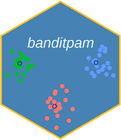

# banditpam 

<!-- badges: start -->
[](https://github.com/motiwari/BanditPAM/actions/workflows/R-CMD-check.yaml)
<!-- badges: end -->

We provide an R interface to the high-performance implementation of
[BanditPAM](https://proceedings.neurips.cc/paper/2020/file/73b817090081cef1bca77232f4532c5d-Paper.pdf) and [BanditPAM++](https://proceedings.neurips.cc/paper_files/paper/2023/file/e885e5bc6e13b9dd8f80bc5482b1fa2f-Paper-Conference.pdf),
a $k$-medoids clustering algorithm.

If you use this software, please cite:

>>Mo Tiwari, Martin Jinye Zhang, James Mayclin, Sebastian Thrun, Chris Piech, Ilan Shomorony. "BanditPAM: Almost Linear Time *k*-medoids Clustering via Multi-Armed Bandits" Advances in Neural Information Processing Systems (NeurIPS) 2020.

>>Mo Tiwari, Ryan Kang*, Donghyun Lee*, Sebastian Thrun, Chris Piech, Ilan Shomorony, Martin Jinye Zhang. "BanditPAM++: Faster k-medoids Clustering" Advances in Neural Information Processing Systems (NeurIPS) 2023.

Here's the BibTeX:
```
@inproceedings{tiwari2020banditpam,
  title={BanditPAM: Almost Linear Time %k%-medoids Clustering via Multi-Armed Bandits},
  author={Tiwari, Mo and Zhang, Martin J and Mayclin, James and Thrun, Sebastian and Piech, Chris and Shomorony, Ilan},
  booktitle={Advances in Neural Information Processing Systems},
  pages={368--374},
  year={2020}
}

@inproceedings{tiwari2023banditpam++,
  title={BanditPAM++: Faster $k$-medoids Clustering},
  author={Tiwari, Mo and Kang, Ryan and Lee, Donghyun and Thrun, Sebastian and Shomorony, Ilan and Zhang, Martin J},
  journal={Advances in Neural Information Processing Systems},
  volume={36},
  pages={73371--73382},
  year={2023}
}
```

## Installation

`banditpam` can be installed from CRAN like any other package. 

## Example

This is a basic example which shows you how to solve a common problem:

``` r
library(banditpam)
## Generate data from a Gaussian Mixture Model with the given means:
set.seed(10)
n_per_cluster <- 40
means <- list(c(0, 0), c(-5, 5), c(5, 5))
X <- do.call(rbind, lapply(means, MASS::mvrnorm, n = n_per_cluster, Sigma = diag(2)))
## Create KMediods object
obj <- KMedoids$new(k = 3)
## Fit data
obj$fit(data = X, loss = "l2")
## Retrieve medoid indices
meds <- obj$get_medoids_final()
## Plot the results
plot(X[, 1], X[, 2])
points(X[meds, 1], X[meds, 2], col = "red", pch = 19)
## Retrieve cluster labels
clusters <- obj$get_labels()
##
## One can query some statistics too; see help("KMedoids")
##
obj$get_statistic("dist_computations")
obj$get_statistic("dist_computations_and_misc")
obj$get_statistic("cache_misses")

```

